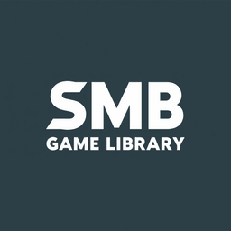

<div align="center">



# SMB Game Library for Playnite

**Turn your home server or NAS into a first-class Playnite library — games copy to your SSD on demand and are cleaned up when you're done.**

[](https://playnite.link/)
[](LICENSE)
[]()

</div>

---

> **This plugin is intended for DRM-free games you legitimately own** — GOG purchases, itch.io downloads, or any other game you have the right to store and run offline. We do not encourage or support piracy in any form.

---

## What it does

GOG, itch.io, and other DRM-free stores let you download your games as plain installers or folders that you own outright — no launcher required, no internet check, yours forever. Many people store these on a NAS or home server to keep them safe and accessible across machines.

A NAS is a great place to *archive* games — it's cheap, roomy, and always on. It's a terrible place to *run* them from. Spinning HDDs over the network can't keep up with a modern SSD, and the manual workflow — browse in File Explorer, copy, wait, unzip, hunt for the `.exe`, make a shortcut — is a chore you have to reverse when the SSD fills up.

SMB Game Library connects Playnite directly to an SMB share and automates the whole cycle:

- Every game subfolder on your share appears in Playnite as an **uninstalled** entry.
- Hit **Install** and the game is **copied or extracted to your local SSD** automatically, with a live progress bar.
- Hit **Uninstall** and the local copy is **deleted to free up space** — your share is never touched.

The result is a fully browsable, controller-friendly library where your server is the permanent vault and your SSD is a fast disposable cache.

---

## Features

- **SMB share as a Playnite library** — point it at a UNC path and every game subfolder becomes an entry in Playnite's library.
- **One-click install to SSD** — copies folders or extracts archives straight from the share, with byte-level progress and speed reporting.
- **One-click uninstall** — removes only the local copy; the share is always opened read-only and is never modified.
- **Controller / couch friendly** — the full install → play → uninstall loop works in Playnite's Fullscreen mode with no keyboard or File Explorer required.
- **Smart executable detection** — automatically identifies the correct game `.exe`, filtering out installers, redistributables, launchers, anti-cheat services, and crash reporters.
- **Pre-flight space check** — estimates the required disk space before starting and shows a clear error if the drive is too full, instead of failing halfway through.
- **Duplicate suppression** — if a game is already installed through Steam, GOG, Epic, etc., the matching share entry is hidden automatically.
- **Exclusion list** — hide specific folders by name, one per line in settings.
- **Optional SMB credentials** — authenticate to password-protected shares without mapping a drive letter.
- **Transient error retry** — file operations over SMB are automatically retried on transient I/O errors.

---

## Supported game folder formats

Each game lives in its own subfolder directly under the share root:

| Folder contents | Type | What *Install* does |
|---|---|---|
| A pre-extracted game folder with a `.exe` | **Pre-installed folder** | Copies the folder to the SSD and wires up the play action |
| A single `.zip`, `.7z`, or `.rar` file | **Single archive** | Extracts the archive to the SSD |

> Archive extraction uses the **SharpCompress** library that ships with Playnite — nothing extra to install.

---

## Installation

### Option A — Packaged extension *(recommended)*

1. Download `NasConnector.pext` from the [Releases](../../releases) page.
2. Double-click it, or in Playnite choose **Add-ons → Install add-on from file**.
3. Restart Playnite when prompted.

### Option B — Build from source

See [Building from source](#building-from-source).

---

## Setup

1. Open **Add-ons → Extensions settings → SMB Game Library** in Playnite.
2. Set **NAS Games Folder** to the UNC path of the folder containing your game subfolders, e.g. `\\192.168.1.20\disk1\Games`.
3. Set **Local Install Directory** to a folder on your fast SSD, e.g. `C:\Games`.
4. Optionally fill in **Authentication** (SMB username and password) if your share requires it. Leave blank to use your current Windows credentials.
5. Optionally add folder names to **Excluded folders** (one per line) to hide specific entries from the library.
6. Click **Test Connection** to verify Playnite can reach the share.
7. Press **F5** (or **Update Game Library**) — your games appear as uninstalled entries tagged **NAS**.
8. Select a game → **Install** → **Play**. When you're done, **Uninstall** reclaims the SSD space.

### Example share layout

```
\\192.168.1.20\disk1\Games\
├── Hollow Knight\
│   └── hollow_knight.exe       ← pre-installed folder
├── Stardew Valley\
│   └── stardew_valley.zip      ← single archive
└── Cyberpunk 2077\
    └── cyberpunk2077.7z        ← single archive
```

---

## Building from source

The project builds with **no Visual Studio or .NET SDK required** — just the standalone Roslyn compiler and the Playnite SDK NuGet package.

### Prerequisites

- Windows with .NET Framework 4.6.2+ (included with Windows 10/11).
- [Playnite](https://playnite.link/) installed — the build references `SharpCompress.dll` from your local Playnite install.
- [`nuget.exe`](https://www.nuget.org/downloads) in the repository root.

### One-time setup

```powershell
# Restore the Playnite SDK NuGet package
.\nuget.exe restore NasConnector\packages.config -PackagesDirectory NasConnector\packages

# Download the standalone Roslyn compiler
.\nuget.exe install Microsoft.Net.Compilers.Toolset -Version 4.9.2 -OutputDirectory build-tools
```

### Build and deploy

```powershell
# Compile and deploy to your local Playnite installation
.\build.ps1

# Compile, deploy, and produce NasConnector.pext for release
.\build.ps1 -Package
```

The DLL is deployed to `%APPDATA%\Playnite\Extensions\NasConnector_7f3a9d12-4b8e-4c21-a5f6-9e0b1c2d3e4f\`. Restart Playnite to load the updated extension.

### Project structure

```
NasConnector/
├── NasConnectorPlugin.cs         # LibraryPlugin entry point — scan, install, uninstall hooks
├── Models/
│   ├── NasGameEntry.cs           # Data model passed between scanner and controllers
│   └── NasGameType.cs            # Enum: PreInstalledFolder, SingleArchive
├── Scanner/
│   ├── NasLibraryScanner.cs      # Walks the share, classifies folders, handles SMB auth
│   └── NameCleaner.cs            # Strips version/build suffixes for clean display names
├── Install/
│   ├── NasInstallController.cs   # Drives the install flow with progress and cancellation
│   ├── NasUninstallController.cs # Deletes local copy only — share is never written to
│   ├── ArchiveInstaller.cs       # SharpCompress extraction with byte-level progress
│   ├── FolderCopier.cs           # Folder copy with progress
│   ├── ExecutableFinder.cs       # Heuristics to identify the correct play executable
│   └── IoRetry.cs                # Retry wrapper for transient SMB I/O errors
├── Settings/
│   ├── NasConnectorSettings.cs           # Plain settings model
│   ├── NasConnectorSettingsViewModel.cs  # ISettings + TestConnectionCommand
│   └── NasConnectorSettingsView.xaml     # WPF settings panel
└── extension.yaml                # Playnite extension manifest
```

---

## How it works

On every library update, the scanner walks the **direct subfolders** of your share path and classifies each one by its contents. Game IDs are stable MD5 hashes of the lowercased folder path, so entries survive Playnite restarts and library refreshes without creating duplicates.

When a game is installed, a pre-flight check estimates the required disk space and aborts early with a clear message if the drive is too full. Install progress is reported at the byte level so large files don't stall the progress bar.

The install controller dispatches by game type: folder games are copied directly; archives are extracted via SharpCompress. After installation, `ExecutableFinder` uses file size and directory name heuristics to identify the real game executable. If it can't determine the right one automatically, a controller-navigable picker is shown so you can choose from a list without leaving Fullscreen mode.

Uninstall removes only the folder inside your local install directory. The share is opened strictly read-only throughout and is never modified.

---

## FAQ

**Does this modify or delete anything on my NAS/server?**  
No. The share is opened read-only. Install copies *from* the share to your SSD; Uninstall deletes only the local SSD copy.

**Do I need to map the share to a drive letter?**  
No. Use the UNC path directly (`\\server\share\folder`). Credentials can be set in the Authentication section if required.

**Where is my SMB password stored?**  
In Playnite's plugin settings file, as plain text. This is designed for a trusted home LAN — don't reuse a sensitive password, and avoid syncing your Playnite config to untrusted cloud services.

**Will it show duplicates of games I already have installed?**  
No. If a game with the same name is already installed through another library (Steam, GOG, etc.), the share entry is hidden automatically.

**What happens if the network drops mid-install?**  
File operations are retried automatically on transient errors. If the install ultimately fails, the partial local copy is cleaned up and the game stays uninstalled.

---

## License

[MIT](LICENSE) © Yavuz Akbay

---

## Acknowledgements

- Built on the [Playnite SDK](https://github.com/JosefNemec/Playnite).
- Archive handling via [SharpCompress](https://github.com/adamhathcock/sharpcompress), bundled with Playnite.
